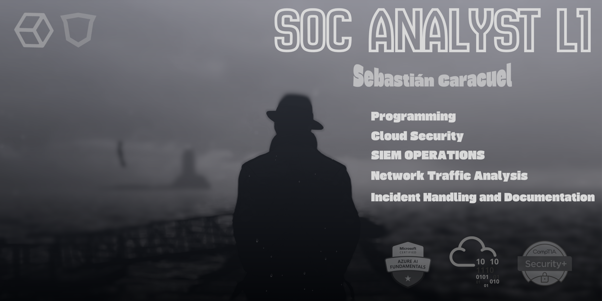

 

<h1 align="center">Hello, I'm <a href="https://www.linkedin.com/in/sebastiancaracuelgonzalez/">Sebastián Caracuel [Weichafe]</a> 👋</h1>

## About me

- 🎓 Computer Engineer graduated from Instituto Duoc Uc, Chile. 
- 🖥️ Consultant SAP BASIS Jr
- 🛡️ SOC Analyst Level 1
 

I am a Computer Engineer with experience in the administration of SAP environments, in transition to the world of cybersecurity🛡️⚔️.

During my career at SAP, I have worked in systems and database administration in critical environments, which has allowed me to develop a strong monitoring, analysis, and troubleshooting skills. This experience and skills gives me a technical foundation to specialize in defensive security, vulnerability management, and incident response.

Currently, I am in a process of training and certification in cybersecurity, with the aim of strengthening my knowledge in system protection and threat mitigation.

🚀 Always in search of new challenges and opportunities to grow professionally.

 

<!--h1 without bottom border-->

  <ul align="center">
    
<h2 style="display: inline-block">Technologies That I Know👨🏻‍💻</h2>

  </ul>

<!--tech stack icons-->

  

