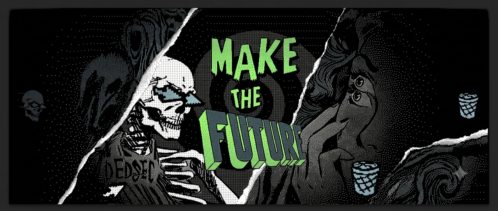
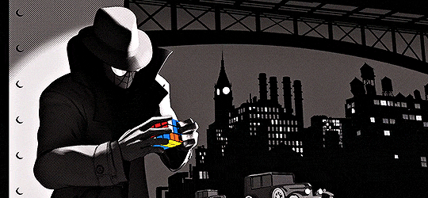

 

  <h2>Know About Me</h2>

  <h3>Hey there! I’m Sebastián</h3>
  I'm a Computer Engineer with an insatiable obsession for learning, powered by caffeine. By night, I sharpen my knowledge and skills as a dedicated cybersecurity apprentice.
  I spend my time threat hunting, analyzing security events, and documenting security breaches in HackTheBox and TryHackMe labs—my daily training grounds. I firmly believe that to be an elite defender, one must master the "attacker mindset."
  When I'm not analyzing alerts, I'm conducting ethical hacking.
    

  
    
  
  &nbsp;
  
  &nbsp;
  
   

 

> Let's build a safer place together, because whether you like it or not, the truth is that we're all vulnerable.

 

  
   

  <table border="0">
    <tr>
      <td width="50%" valign="top">
        <h3><a href="#">SOC Automation Lab</a></h3>
        
Deployment of a real-world monitoring environment using <b>Splunk</b> or <b>Elastic Stack</b> for log ingestion and real-time detection of brute-force attacks.

        

          
          
        

      </td>
      <td width="50%" valign="top">
        <h3><a href="#">Incident Investigation Write-ups</a></h3>
        
Detailed technical documentation (reports) on machine challenges on <b>HackTheBox</b> and <b>TryHackMe</b>, focusing on defensive analysis and log traces.

        

          
          
        

      </td>
    </tr>
    <tr>
      <td width="50%" valign="top">
        <h3><a href="#">SAP BASIS Admin & Operations</a></h3>
        
Technical repository on system administration <b>R3 and S/4 HANA</b>. Documentation of critical activities.

        

          
          
        

      </td>
      <td width="50%" valign="top">
        <h3><a href="https://github.com/SebastianCaracuel?tab=repositories">Explore More →</a></h3>
        
Accede a todos mis repositorios, desde scripts de automatización en Bash hasta mis configuraciones de laboratorios de red y seguridad en la nube.

      </td>
    </tr>
  </table>

 

  
    

  <table align="center" style="background: transparent; border: none;">
    <tr>
      <td align="right" valign="middle" style="padding-right: 20px;">
        <strong>Blue Team (Defensive)</strong>
      </td>
      <td align="left" valign="middle">
        
        
        
        
        
        
        
        
      </td>
    </tr>
    <tr>
      <td align="right" valign="middle" style="padding-right: 20px;">
        <strong>Red Team (Offensive)</strong>
      </td>
      <td align="left" valign="middle">
        
        
        
        
        
      </td>
    </tr>
    <tr>
      <td align="right" valign="middle" style="padding-right: 20px;">
        <strong>SAP BASIS Infrastructure</strong>
      </td>
      <td align="left" valign="middle">
        
        
        
        
         
        
        
        
        
      </td>
    </tr>
    <tr>
      <td align="right" valign="middle" style="padding-right: 20px;">
        <strong>Tools & Automation</strong>
      </td>
      <td align="left" valign="middle">
        
        
        
        
      </td>
    </tr>
  </table>

