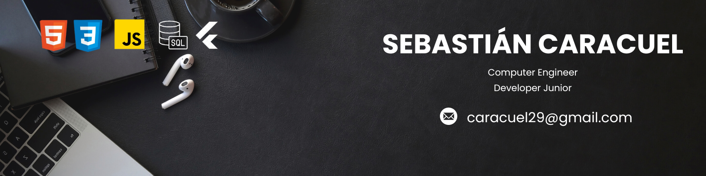

 

<h1 align="center">Hello, I'm <a href="https://www.linkedin.com/in/sebastiancaracuelgonzalez/">Sebastián Caracuel</a> 👋</h1>

## About me
 
- 🚀 Full Stack Developer
- 🎓 Computer Engineer graduated from Instituto Duoc Uc, Chile.
- 📲 Movile developer
  
 

Computer Engineer recently graduated, creating and learning new skills and knowledge, to develop myself as a person and as a professional.

I am currently taking courses to specialize even more, to be able to design UI/UX with the help of Figma, develop, test and maintain applications. Skilled in problem solving, genuine sense of service and great analytical skills.

 

<!--h1 without bottom border-->

  <ul align="center">
    
<h2 style="display: inline-block">Technologies That I Know👨🏻‍💻</h2>

  </ul>

<!--tech stack icons-->

  

 

 

  <h3><b>🚀 Profile Visitor Count</b></h3>

    
<!-- retro visitor counter -->  

   
    

You have finally discovered my Github profile.  
Feel free to contact me, leave a star, nice to meet you and that you have met me too.  
Ask me anything 

  <!--  -->
	
	
	
	 
	

<i>Happy Coding!</i> 😊

